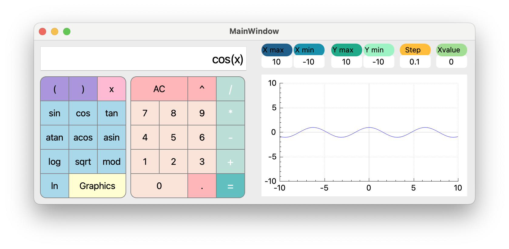

# SmartCalc_v1.0
## Description

An extended version of the calculator.

In addition to basic arithmetic operations such as add/subtract and multiply/divide,the calculator has the ability to calculate arithmetic expressions (sine, cosine, logarithm, etc.).

The app also support the use of the x variable and the graphing of the corresponding function.

* used Dijkstra's algorithm and reverse polish notation in C
* created GUI using C++(QT 5)
* the project is covered with tests using the check.h library (make test)

## Installation

In terminal go to project folder and run make install.

## Uninstallation

In terminal go to project folder and run make uninstall.

## App

In the folder "SmartCalc" you can find the already builded app.
